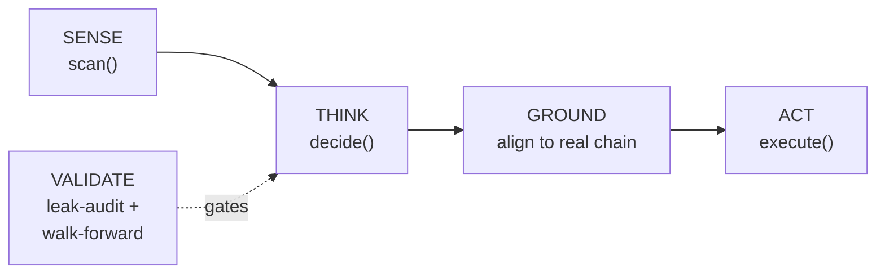

# WorryFree Options Trading — Hackathon Submission

**Event:** [Alpaca AI Trading Agents Hackathon](https://lablab.ai/ai-hackathons/alpaca-ai-trading-agents-hackathon) (lablab.ai)
**Repo:** https://github.com/MoniGula/Worryfree-OptionsTrading

This document is the judge-facing pitch: what we're trying to do, what we actually built, and — since this is an *agent* hackathon — precisely where the agent sits and what decisions it's autonomously responsible for. The [README](README.md) covers setup and API details; this covers the "why" and the "how it thinks."

## The problem

Retail options selling is usually one of two things: a fully manual chore (a person has to check charts, pull an option chain, eyeball IV, and place multi-leg orders by hand every day), or a naive backtested bot that looks great on paper because its features quietly peek at the future — a rolling z-score normalized over the whole sample, a "signal" computed with a centered window, a fill price sourced from a bar that hadn't closed yet. Both fail the same way in practice: no one is *systematically and continuously* checking "is the market currently paying me enough premium to justify the risk of selling it?" — and even when someone tries to, the historical validation backing the decision is usually broken in ways that don't show up until real money is on the line.

WorryFree is an autonomous agent that runs this check every trading day: it decides, without a human in the loop, whether current option prices are rich enough relative to a volatility forecast to sell premium — and if so, which defined-risk structure to sell and at what real, tradeable strikes — then places the trade itself.

## What we built: the agent's sense → think → act → verify loop

This is the core orchestration, and it maps directly onto the classic agent loop:



1. **Sense — `scan()`.** For every underlying on the watchlist (SPY, QQQ, AAPL, MSFT, AMD, NVDA, TSLA by default, configurable via `.env`), the agent independently pulls fresh price history and computes realized volatility, an implied-vol proxy, IV Rank, volatility risk premium (VRP), ADX trend strength, and range-bound probability. Every symbol is evaluated independently and a bad data point for one symbol (e.g. a stale/placeholder price bar) can't block or corrupt the others — each is scanned in isolation and skipped safely if its inputs aren't trustworthy.

2. **Think — `decide()` → `decision_engine.route_strategy()`.** This is the agent's actual judgment call, and it's a transparent, auditable rule set rather than a black box:
   - No edge, no trade: a symbol is skipped entirely unless `IV Rank ≥ 0.30` **and** volatility risk premium `≥ 0` — i.e. the agent only acts when the options market is pricing in more movement than the underlying has actually been realizing, and by enough of a margin to call it a real edge, not noise.
   - Given an edge exists, the agent reads the *shape* of the market to decide the structure: `ADX ≥ 25` (trending) routes to a **credit spread** in the trend's direction; `ADX ≤ 20` (range-bound) routes to an **iron butterfly** centered on price to harvest theta from pinning. Anything in between is judged too ambiguous and the agent takes no position.
   - This regime classification is what makes it an *agent's* decision rather than a fixed schedule — the same symbol can be routed to a completely different strategy, or no strategy at all, from one day to the next purely based on what the agent currently observes about that name's volatility and trend regime.

3. **Ground — chain alignment.** A model's theoretical strike (say, "sell the 0.20-delta put") is not automatically a strike Alpaca actually lists. Before acting, the agent fetches the real, currently-listed option chain, snaps every theoretical strike/expiry onto the nearest real, active contract, and — critically — refuses to fall back onto an expiration that has already closed for trading. This is the layer that turns "a model's opinion" into "an order that will actually execute," and it fails safely (skips that symbol, logs why) rather than submitting garbage.

4. **Act — `execute()` → `alpaca_client.py`.** The agent builds and submits a real multi-leg (MLeg) order — a true single-ticket credit spread or iron butterfly, not four separate naked legs — against Alpaca's Trading API. In our own test runs this week, the agent autonomously scanned all 7 symbols, decided 7 tradeable setups, snapped every one of them onto real contracts, and got all 7 accepted by Alpaca's paper-trading engine end to end with no human touching an order ticket.

5. **Validate — the gate a feature has to clear before it's trusted with real orders.** `src/validation/` is a standalone auditing toolkit, run by us as developers (and reproducible by anyone, see the demo below) against every feature before it's wired into `decide()`: `leak_scanner.py` catches the three most common look-ahead leaks (full-sample normalization, centered/forward rolling windows, future-timestamp joins); `walk_forward.py` enforces strictly chronological, non-overlapping train/validation splits so any backtest claim is honest; `feature_diagnostics.py` and `report.py` turn that into a reviewable Markdown report. To be precise: this is a pre-deployment audit gate, not a per-run runtime check inside `main.py` — every feature actually used by `decide()` has been run through it during development, but the agent doesn't re-invoke the scanner on live data every morning. It's what separates an agent we'd actually let touch an account from a backtest that quietly cheated, and it's why we could confidently trust the regime-classification thresholds in step 2 instead of guessing at them.

## Where the "AI" is, honestly

We want to be direct about this rather than oversell it: the decision logic is a transparent, rule-based regime classifier (ADX + IV Rank + VRP thresholds), not an LLM prompted to "decide what to trade." We made that choice deliberately for a hackathon judged on *trading agents* handling real (paper) capital — a rules-based agent is auditable, replayable, and its failure modes are debuggable line by line, which matters enormously when the "action" is an irreversible order submission. What makes it an *agent* rather than a script is the autonomy and closed-loop structure: it independently senses fresh market state every run, forms a judgment per symbol from that state (not a fixed calendar), grounds that judgment against live, changing exchange data before acting, executes without human sign-off, and every feature behind that judgment has been put through a standalone audit gate for the exact kind of silent errors (look-ahead leakage) that make so many "trading bots" fake. The architecture is intentionally built so an LLM-driven policy layer could be dropped in on top of `decide()` later without touching the sensing, grounding, execution, or validation layers at all — those are already the hard, unglamorous parts that make any policy on top of them trustworthy.

## Risk posture

- Every strategy used (credit spreads, iron butterflies) is **defined-risk by construction** — max loss is capped by spread/wing width, never by account size or margin.
- Per-trade and total-portfolio collateral caps (`MAX_POSITION_SIZE`, `MAX_PORTFOLIO_COLLATERAL_PCT`) bound the agent's blast radius.
- An earnings-proximity exclusion gate (`MIN_DAYS_TO_EARNINGS`) is already wired into configuration, pending a live earnings-calendar feed.
- Runs exclusively against Alpaca's **paper-trading** endpoint. No live capital, no investment advice.

## Tech stack

Python · `alpaca-py` (Alpaca Trading API, multi-leg options orders) · `yfinance` (price history) · `pandas` / `numpy` / `scipy` (feature engineering) · `pytest` (65 unit tests covering every module, including negative-control tests against the exact bugs found during development) · GitHub for source control.

## Demo walk-through for judges

Three commands, roughly five minutes, no Alpaca account required for the first two:

1. **Run the test suite** (proves the logic, including the exact bugs found and fixed during development, via negative-control tests):

   ```bash
   pip install -r requirements.txt
   python -m pytest -v
   ```

   Expect `65 passed` — including tests that assert a NaN underlying price or an infinite IV Rank is *rejected* rather than crashing the decision engine (a real bug we hit and fixed on live weekend data), and tests that assert a centered/leaky rolling window is *caught* by the validation module rather than silently accepted.

2. **Run the validation demo against real, live market data** (no API keys needed — this only reads public price history):

   ```bash
   python demo_validation.py
   ```

   This pulls real SPY closes via `yfinance`, builds a legitimate trailing-window feature and a deliberately leaky centered-window twin of the same computation, and runs both through `src/validation/leak_scanner.py` live. It then runs a real (small-sample, honestly-scored) walk-forward evaluation via `src/validation/walk_forward.py` and writes a `VALIDATION_REPORT.md` you can open directly. A real run against live data produced:

   ```
   Leak audit — causal 20d mean(|return|): PASSED
   Leak audit — centered-window mean(|return|) (control): FAILED
     - Rolling feature (window=20) matches a centered window more closely
       than a trailing one — this includes future bars and is a
       look-ahead leak.

   Walk-forward validation — 20d realized vol vs next-day |return|
   Folds run: 6, Mean score: -0.5053 (over the 2 non-degenerate folds)
   ```

   The negative correlation itself isn't the point (6 months of one ticker's data is a small, noisy sample) — the point is that the scanner correctly separates the honest feature from its leaky twin, and the walk-forward result is reported as-is, degenerate folds and all, rather than cherry-picked.

3. **Run the live agent** (requires a free Alpaca paper-trading key from [alpaca.markets](https://alpaca.markets), see [README setup](README.md#setup)):

   ```bash
   python -m src.main
   ```

   This is the real sense → think → ground → act loop described above, against Alpaca's live-listed option chain. A run during market hours will scan the watchlist, log each symbol's regime classification and routing decision, and submit any resulting multi-leg orders — our own such run got all 7 watchlist symbols to `OrderStatus.ACCEPTED`.

## What's next

- Replace the realized-vol-based implied-vol proxy with a live options-chain-derived ATM IV feed, once wired in.
- Wire the earnings-exclusion gate to a live calendar source.
- Add position management (profit-taking at `PROFIT_TAKE_PCT`, defined exit rules) as a scheduled follow-up pass rather than only new-position entry.
- Optionally add an LLM-driven overlay on top of `decide()` for qualitative regime commentary or news-aware overrides, without touching the validated sensing/execution core.
